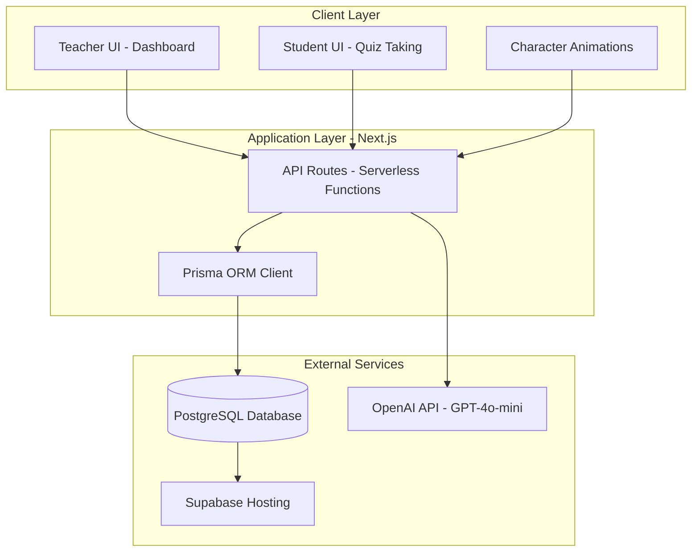
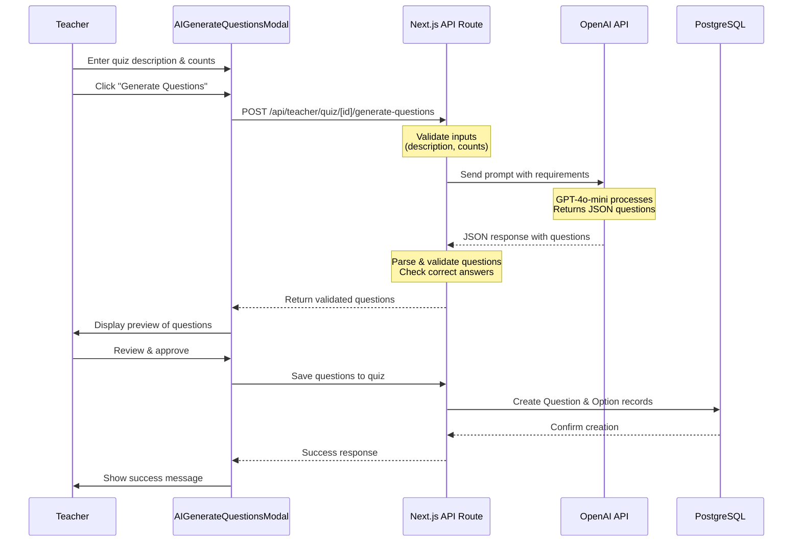
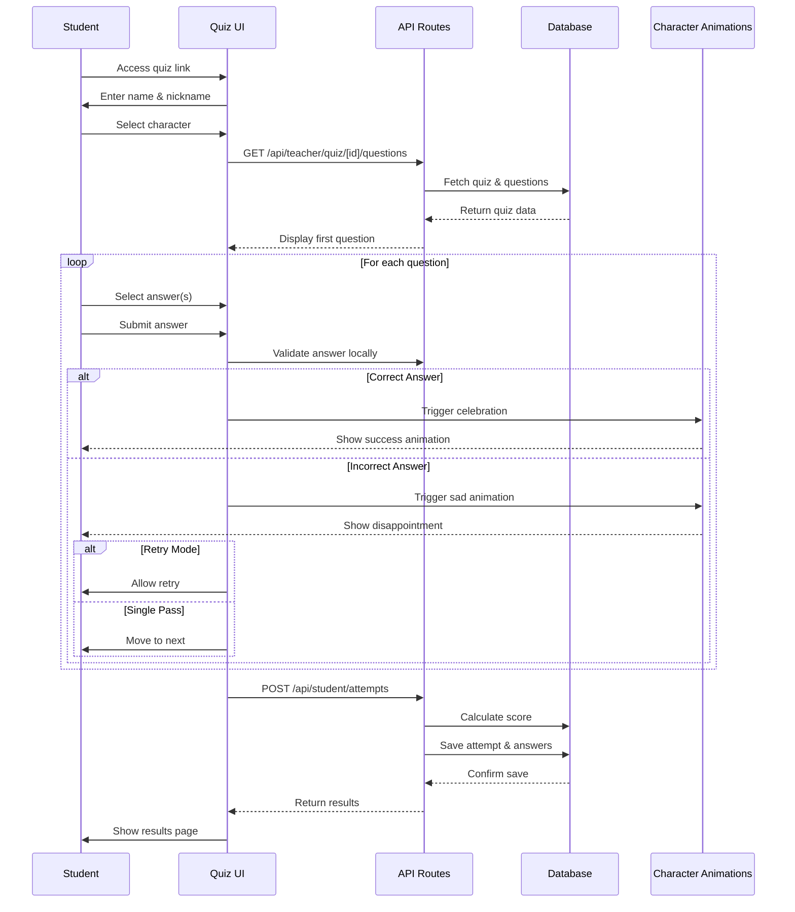
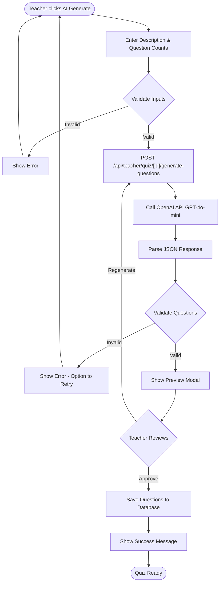
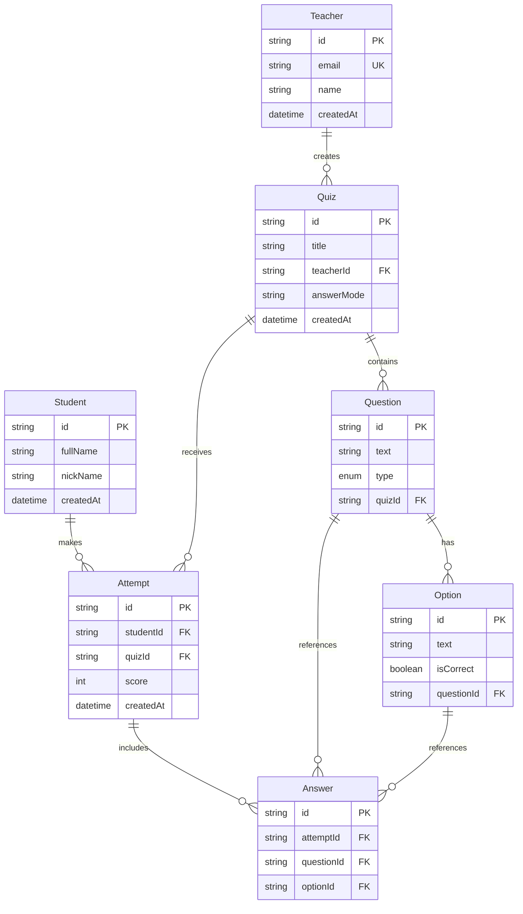
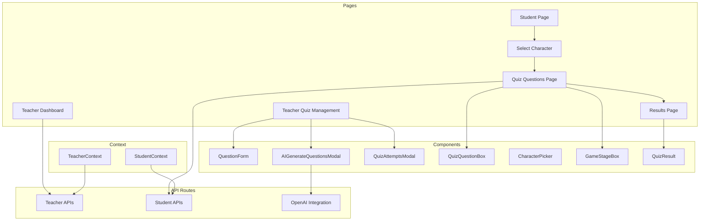
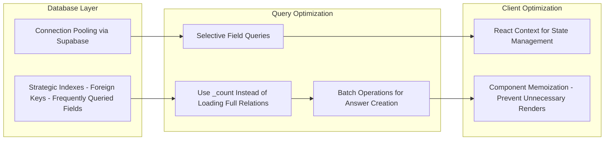
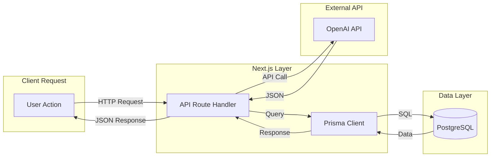

# Quiz Companion - System Architecture Diagrams

This document contains Mermaid diagrams that can be rendered in:
- GitHub (native support)
- VS Code (with Mermaid extension)
- Documentation sites (Docusaurus, GitBook, etc.)
- Online tools (mermaid.live)

---

## 1. High-Level System Architecture

---

## 2. AI Quiz Generation Sequence Diagram

---

## 3. Student Quiz Taking Flow

---

## 4. AI Generation Process Flow

---

## 5. Database Entity Relationship Diagram

---

## 6. Component Architecture

---

## 7. Performance Optimization Strategy

---

## 8. Request Flow Diagram

---

## How to Render These Diagrams

### Option 1: GitHub
- Simply push this file to GitHub - Mermaid diagrams render automatically

### Option 2: VS Code
- Install "Markdown Preview Mermaid Support" extension
- Open this file and use Markdown preview

### Option 3: Online Editor
- Copy diagram code to [mermaid.live](https://mermaid.live)
- Export as PNG/SVG for presentations

### Option 4: Documentation Sites
- Docusaurus, GitBook, and many others support Mermaid natively

---

## Notes for Interview Presentation

1. **Start with High-Level Architecture** (Diagram 1) - Shows overall system
2. **Explain AI Integration** (Diagrams 2 & 4) - Key differentiator
3. **Show User Flow** (Diagram 3) - Demonstrates user experience focus
4. **Database Design** (Diagram 5) - Shows data modeling skills
5. **Component Structure** (Diagram 6) - Shows code organization
6. **Performance** (Diagram 7) - Shows optimization thinking

These diagrams can be used in:
- PowerPoint presentations (export as images)
- Live coding demos
- Whiteboard discussions
- Documentation

